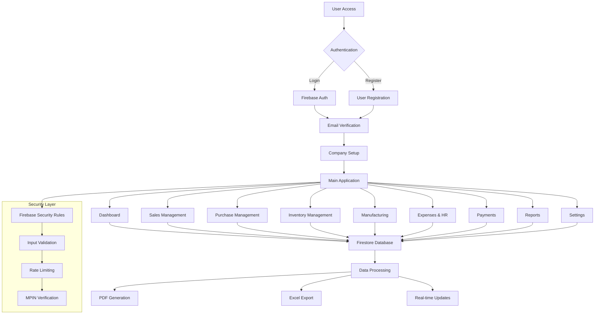
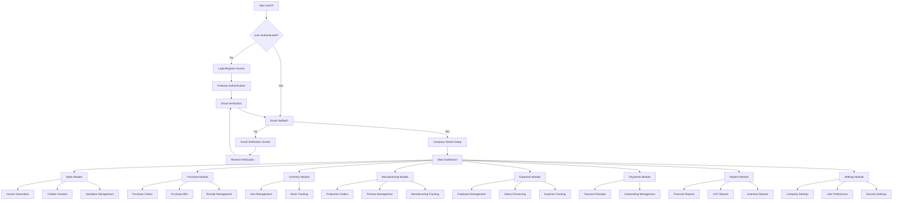

# ACCTOO - Complete Software Summary

## 🏢 **Software Overview**

**ACCTOO** is a comprehensive business accounting and inventory management system built as a Progressive Web App (PWA) with cross-platform capabilities. It's designed for small to medium businesses to manage their complete financial operations, inventory, manufacturing processes, and employee management.

### **Core Technologies & Architecture**
- **Frontend**: React 19.1.0 with React Router DOM 7.7.0
- **Backend**: Firebase (Firestore, Authentication, Storage, Functions)
- **Mobile**: Capacitor 7.4.2 for Android/iOS deployment
- **Desktop**: Electron 37.2.4 for desktop application
- **Styling**: Tailwind CSS 4.0.0
- **Charts**: Recharts 3.1.0
- **PDF Generation**: jsPDF with AutoTable
- **Security**: Firebase Security Rules with custom validation

### **Firebase Project ID**: `acc-app-e5316`

---

## 🔄 **System Architecture Flowchart**



---

## 📱 **Application Flow & Navigation**



---

## 📄 **Detailed Page-by-Page Breakdown**

### **1. Authentication & Onboarding**

#### **Login Form (`LoginFormWithFirebase.js`)**
- **Purpose**: User authentication with Firebase
- **Features**:
  - Email/password login
  - Google reCAPTCHA integration
  - Password reset functionality
  - Account lockout protection
  - Login attempt tracking
- **Security**: Rate limiting, brute force protection
- **ID Used**: `loginEmail`, `loginPassword`, `loginError`

#### **Registration (`App.js` - Registration Section)**
- **Purpose**: New user account creation
- **Features**:
  - Email validation
  - Password strength requirements
  - Company name registration
  - Contact information
  - Email verification setup
- **ID Used**: `registerEmail`, `registerPassword`, `registerCompany`, `registerContact`

#### **Email Verification (`EmailVerification.js`)**
- **Purpose**: Verify user email addresses
- **Features**:
  - Automatic verification check
  - Manual verification
  - Resend verification email
  - Skip verification option
- **ID Used**: `verificationCode`, `isVerifying`, `resendTimer`

#### **Company Details Wizard (`CompanyDetailsWizard.js`)**
- **Purpose**: Initial company setup for new users
- **Features**:
  - Multi-step wizard interface
  - Company information collection
  - GST registration details
  - Business type selection
  - Address and contact details
- **ID Used**: `companyWizardStep`, `showCompanyDetailsWizard`

---

### **2. Dashboard (`Dashboard.js`)**

#### **Main Dashboard Overview**
- **Purpose**: Central hub for business metrics and quick actions
- **Key Metrics Displayed**:
  - Total customers and suppliers
  - Total items in inventory
  - Monthly sales and purchases
  - Outstanding receivables and payables
  - Last 7 days sales trend

#### **Todo Management System**
- **Features**:
  - Personal task management
  - Priority levels (High, Medium, Low)
  - Categories (Personal, Urgent, Follow-up)
  - Real-time synchronization with Firebase
  - Task completion tracking
- **ID Used**: `todos`, `newTodoText`, `filterCategory`

#### **Quick Actions**
- **Features**:
  - Quick navigation to all modules
  - Recent transactions display
  - Outstanding bills overview
  - Payment reminders
- **ID Used**: `partiesList`, `partyOutstanding`

#### **Charts and Analytics**
- **Features**:
  - Sales trend charts
  - Revenue analytics
  - Customer/supplier distribution
  - Financial year summaries
- **ID Used**: `receivableList`, `payableList`

---

### **3. Sales Management (`Sales.js`)**

#### **Invoice Management**
- **Purpose**: Complete sales invoice creation and management
- **Features**:
  - Multi-item invoice creation
  - GST calculation (CGST/SGST/IGST)
  - Party selection with auto-complete
  - Item selection with pricing
  - Area-based calculations
  - Multiple payment terms
- **ID Used**: `rows`, `selectedParty`, `invoiceNumber`

#### **Document Types**
- **Invoice**: Complete sales invoice with GST
- **Challan**: Delivery challan for goods
- **Quotation**: Price quotations for customers
- **Receipt**: Payment receipts

#### **Advanced Features**
- **GST Calculation**:
  - Automatic CGST/SGST split for same state
  - IGST for inter-state transactions
  - GST rate management
- **Payment Integration**:
  - Advance payment allocation
  - Outstanding balance tracking
  - Payment history
- **Document Generation**:
  - PDF invoice generation
  - Print functionality
  - Email integration
- **ID Used**: `gstPercent`, `advanceAmount`, `outstandingAmount`

---

### **4. Purchase Management (`Purchases.js`)**

#### **Purchase Order Management**
- **Purpose**: Complete purchase cycle management
- **Features**:
  - Purchase order creation
  - Supplier management
  - Item requisition
  - Order tracking
  - Delivery management
- **ID Used**: `purchaseOrders`, `selectedSupplier`

#### **Purchase Bill Processing**
- **Features**:
  - Bill entry with GST
  - Item-wise breakdown
  - Payment terms
  - Credit period management
- **ID Used**: `purchaseBills`, `billNumber`

#### **Receipt Management**
- **Features**:
  - Goods receipt notes
  - Quality inspection
  - Stock updates
  - Return processing
- **ID Used**: `receipts`, `receiptNumber`

---

### **5. Inventory Management (`Items.js`)**

#### **Item Master Management**
- **Purpose**: Complete inventory item management
- **Features**:
  - Item creation and categorization
  - Unit management (Pieces, Kg, Sq. Ft., etc.)
  - Pricing structure
  - Stock levels
  - Reorder points
- **ID Used**: `items`, `itemName`, `itemCode`

#### **Stock Management**
- **Features**:
  - Real-time stock tracking
  - Stock movements
  - Stock valuation
  - Low stock alerts
  - Stock reports
- **ID Used**: `stockLevel`, `reorderPoint`

#### **Category Management**
- **Features**:
  - Item categorization
  - Category-wise reports
  - Bulk operations
  - Import/export functionality
- **ID Used**: `categories`, `selectedCategory`

---

### **6. Manufacturing Management (`ManufacturingNew.js`)**

#### **Production Order Management**
- **Purpose**: Complete manufacturing process management
- **Features**:
  - Production order creation
  - Process definition
  - Material requirements
  - Work-in-progress tracking
  - Quality control
- **ID Used**: `productionOrders`, `orderNumber`

#### **Process Management**
- **Features**:
  - Process step definition
  - Time estimation
  - Resource allocation
  - Quality checkpoints
  - Cost calculation
- **ID Used**: `processDefinitions`, `processSteps`

#### **Manufacturing Tracking**
- **Features**:
  - Real-time production status
  - Material consumption
  - Labor tracking
  - Quality metrics
  - Cost analysis
- **ID Used**: `manufacturingStatus`, `materialConsumption`

---

### **7. Expenses & HR Management (`Expenses.js`)**

#### **Employee Management**
- **Purpose**: Complete HR and payroll management
- **Features**:
  - Employee registration
  - Salary structure management
  - Document management (Aadhaar, PAN, etc.)
  - Bank details
  - Attendance tracking
- **ID Used**: `employees`, `employeeForm`

#### **Salary Management**
- **Features**:
  - CTC calculation
  - Component-wise salary breakdown
  - PF and tax calculations
  - Salary disbursement
  - Payslip generation
- **ID Used**: `salaryStructure`, `ctcAmount`

#### **Expense Tracking**
- **Features**:
  - Expense categorization
  - Receipt management
  - Approval workflow
  - Expense reports
  - Budget tracking
- **ID Used**: `expenses`, `expenseCategories`

---

### **8. Payments Management (`Payments.js`)**

#### **Payment Processing**
- **Purpose**: Complete payment management system
- **Features**:
  - Customer receipt entry
  - Supplier payment processing
  - Multiple payment modes
  - Bank reconciliation
  - Payment history
- **ID Used**: `payments`, `paymentMode`

#### **Outstanding Management**
- **Features**:
  - Outstanding bill tracking
  - Payment reminders
  - Aging analysis
  - Collection reports
  - Follow-up management
- **ID Used**: `outstandingBills`, `agingAnalysis`

#### **Receipt Generation**
- **Features**:
  - Professional receipt templates
  - PDF generation
  - Email integration
  - Digital signatures
- **ID Used**: `receiptTemplate`, `receiptNumber`

---

### **9. Reports (`Reports.js`)**

#### **Financial Reports**
- **Purpose**: Comprehensive business reporting
- **Report Types**:
  - Profit & Loss Statement
  - Balance Sheet
  - Cash Flow Statement
  - Party-wise ledgers
  - Sales/Purchase reports
- **ID Used**: `reportType`, `dateRange`

#### **GST Reports**
- **Features**:
  - GST Summary (Regular/Composition)
  - GST Return preparation
  - Tax liability calculation
  - Input tax credit
- **ID Used**: `gstReports`, `taxPeriod`

#### **Inventory Reports**
- **Features**:
  - Stock valuation
  - Movement analysis
  - Slow-moving items
  - ABC analysis
- **ID Used**: `inventoryReports`, `stockValue`

---

### **10. Settings & Configuration**

#### **Company Settings (`CompanyDetails.js`)**
- **Purpose**: Company profile and configuration
- **Features**:
  - Company information
  - GST registration
  - Bank details
  - Logo management
  - Business settings
- **ID Used**: `companyDetails`, `gstin`

#### **User Settings (`Settings.js`)**
- **Features**:
  - User profile management
  - Password changes
  - Notification preferences
  - Security settings
  - MPIN configuration
- **ID Used**: `userSettings`, `mpin`

#### **Admin Panel (`AdminPanel.js`)**
- **Features**:
  - User management
  - System configuration
  - Data backup/restore
  - Audit logs
  - Performance monitoring
- **ID Used**: `adminSettings`, `userManagement`

---

## 🔐 **Security Implementation**

### **Firebase Security Rules**
```javascript
// User Authentication
function isUserAuthenticated(userId) {
  return request.auth != null && request.auth.uid == userId;
}

// Email Verification
function isUserVerified(userId) {
  return request.auth != null && 
         request.auth.uid == userId && 
         request.auth.token.email_verified == true;
}

// User Status Check
function isUserActive(userId) {
  return request.auth != null && 
         request.auth.uid == userId && 
         get(/databases/$(database)/documents/users/$(userId)).data.status == 'active';
}
```

### **Data Protection**
- **Encryption**: All data encrypted in transit and at rest
- **Access Control**: Role-based access control
- **Audit Trail**: Complete audit logging
- **Rate Limiting**: API rate limiting to prevent abuse
- **Input Validation**: Comprehensive input sanitization

---

## 📊 **Database Structure**

### **Firestore Collections**
```
artifacts/{appId}/
├── users/{userId}/
│   ├── parties/          # Customers & Suppliers
│   ├── items/            # Inventory Items
│   ├── sales/            # Sales Documents
│   ├── purchases/        # Purchase Documents
│   ├── payments/         # Payment Records
│   ├── expenses/         # Expense Records
│   ├── employees/        # Employee Data
│   ├── manufacturing/    # Production Data
│   ├── todos/            # Task Management
│   └── companyDetails/   # Company Information
├── companies/{companyId}/
│   ├── members/          # Company Members
│   └── referenceLinks/   # Reference Data
users/{userId}            # User Profiles
verificationCodes/        # Email/Phone Verification
userSessions/             # Login Sessions
```

---

## 🚀 **Deployment & Distribution**

### **Platform Support**
- **Web**: Progressive Web App (PWA)
- **Android**: Native Android app via Capacitor
- **iOS**: Native iOS app via Capacitor
- **Desktop**: Electron application

### **Build Commands**
```bash
# Web Development
npm start                    # Development server
npm run build               # Production build

# Mobile Development
npx cap add android         # Add Android platform
npx cap add ios             # Add iOS platform
npx cap sync                # Sync with native platforms

# Desktop Development
npm run electron            # Run Electron app
npm run electron-build      # Build desktop app

# Firebase Deployment
npm run firebase:deploy     # Deploy to Firebase
npm run firebase:deploy:rules # Deploy security rules
```

---

## 📈 **Key Features Summary**

### **Business Management**
- ✅ Complete accounting system
- ✅ Inventory management
- ✅ Manufacturing process management
- ✅ HR and payroll management
- ✅ Multi-branch support
- ✅ Real-time collaboration

### **Document Management**
- ✅ Invoice generation
- ✅ Purchase order management
- ✅ Receipt processing
- ✅ Document templates
- ✅ PDF generation
- ✅ Email integration

### **Financial Features**
- ✅ GST compliance
- ✅ Tax calculations
- ✅ Payment processing
- ✅ Outstanding management
- ✅ Financial reporting
- ✅ Audit trails

### **Security & Compliance**
- ✅ Multi-factor authentication
- ✅ Role-based access control
- ✅ Data encryption
- ✅ Audit logging
- ✅ GDPR compliance
- ✅ Regular security updates

---

## 🔗 **Integration Points**

### **External Integrations**
- **Payment Gateways**: UPI, NEFT, RTGS, IMPS
- **Email Services**: Firebase Email, SMTP
- **SMS Services**: Phone verification
- **Cloud Storage**: Firebase Storage
- **Analytics**: Firebase Analytics

### **Data Export/Import**
- **Excel Export**: XLSX format
- **PDF Export**: jsPDF with AutoTable
- **CSV Import**: Bulk data import
- **Backup/Restore**: Complete data backup

---

This comprehensive system provides a complete business management solution with robust security, real-time synchronization, and cross-platform compatibility. The modular architecture allows for easy scaling and feature additions while maintaining data integrity and user experience consistency across all platforms. 