# ACCTOO - Detailed Flowcharts & Data Flow

## 🔄 **Complete Data Flow Architecture**

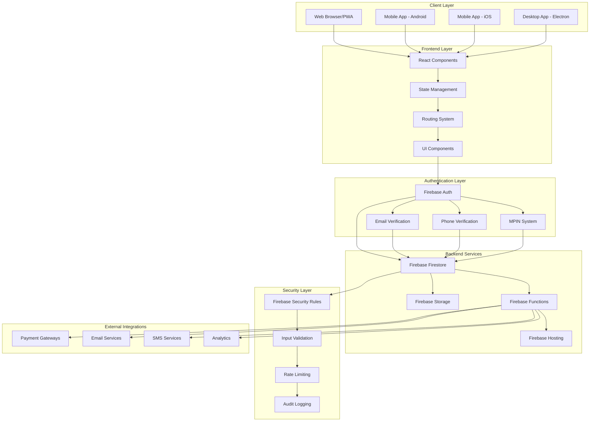

---

## 📊 **Database Schema & Relationships**

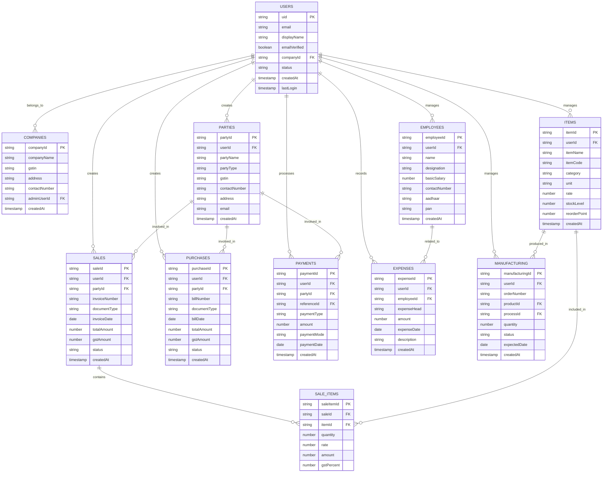

---

## 🔐 **Authentication & Security Flow**

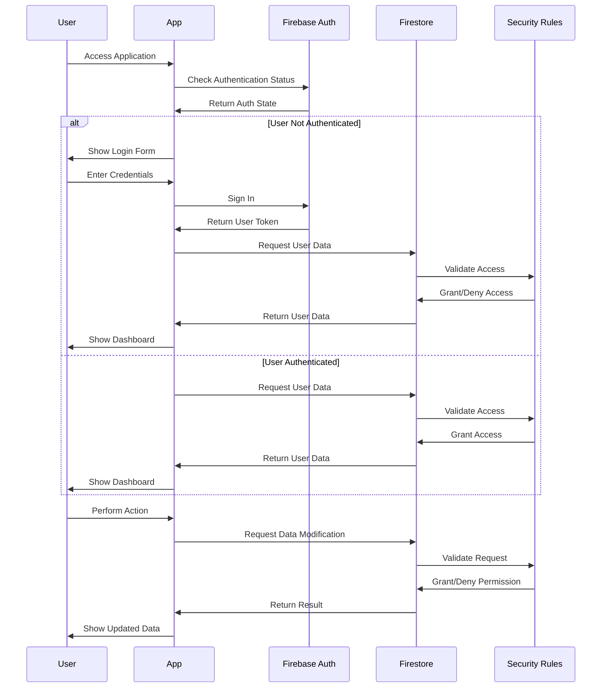

---

## 💼 **Business Process Flow**

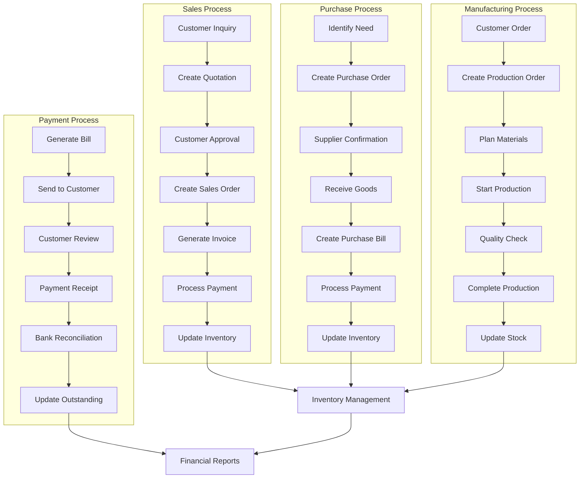

---

## 📱 **User Journey Flow**

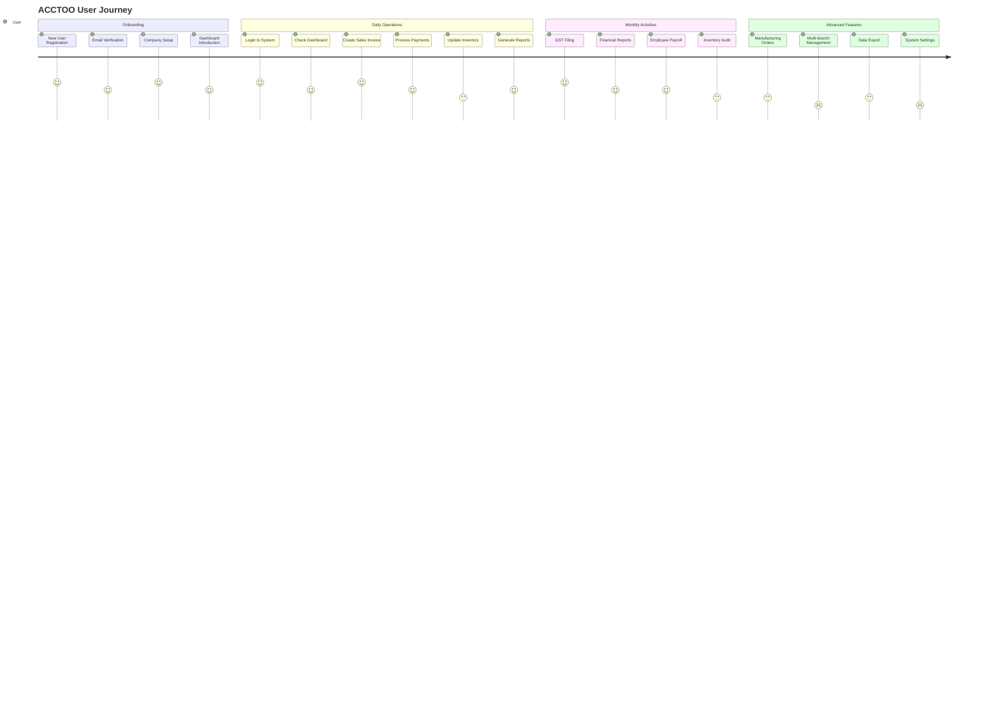

---

## 🔄 **Real-time Data Synchronization**

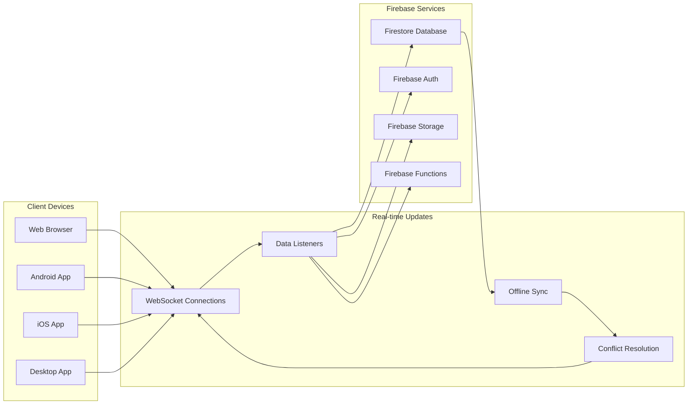

---

## 📊 **Reporting & Analytics Flow**

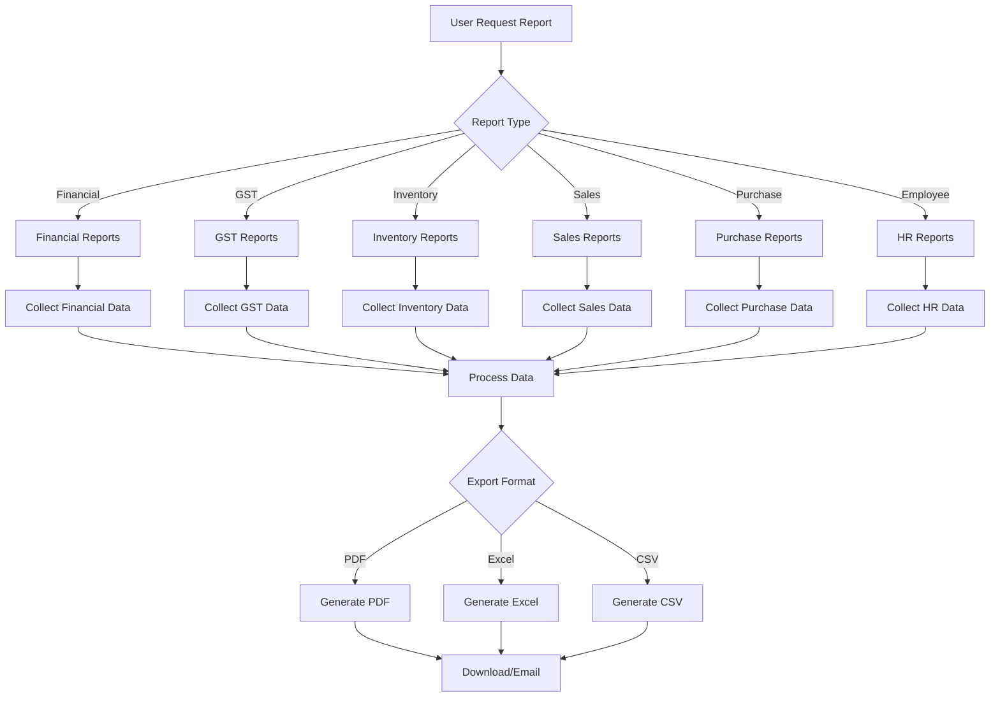

---

## 🔧 **Component Interaction Flow**

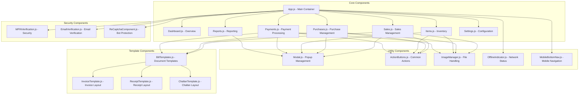

---

## 📈 **Performance & Scalability Flow**

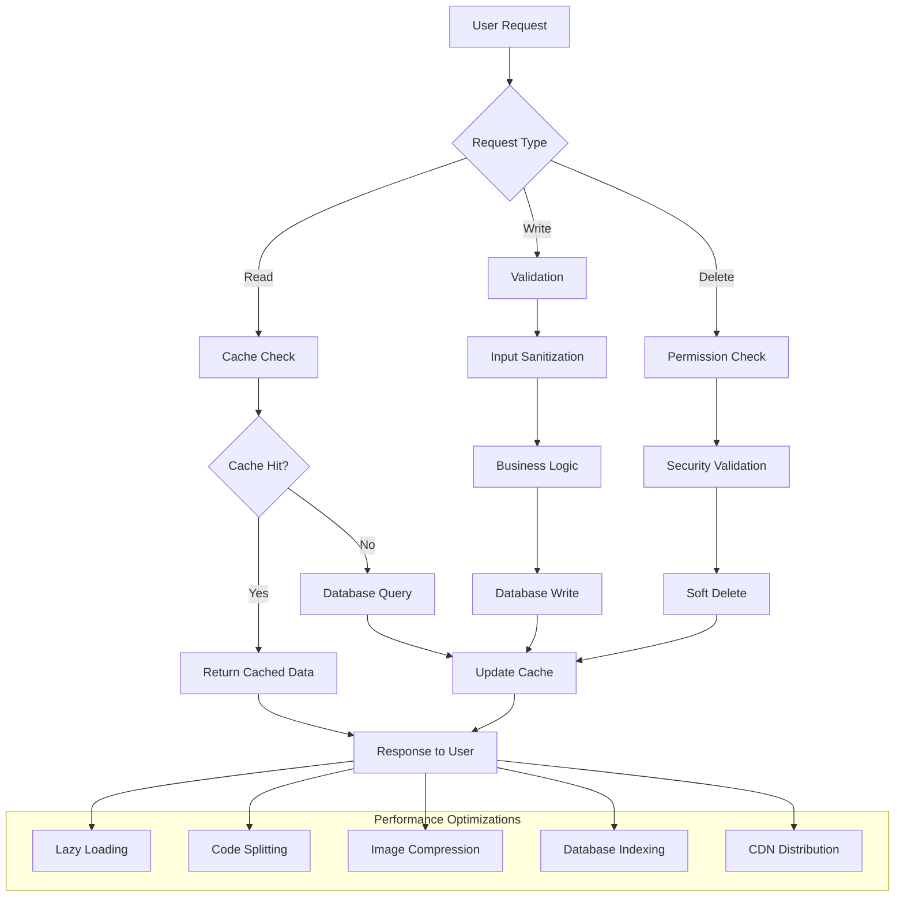

---

## 🔄 **Error Handling & Recovery Flow**

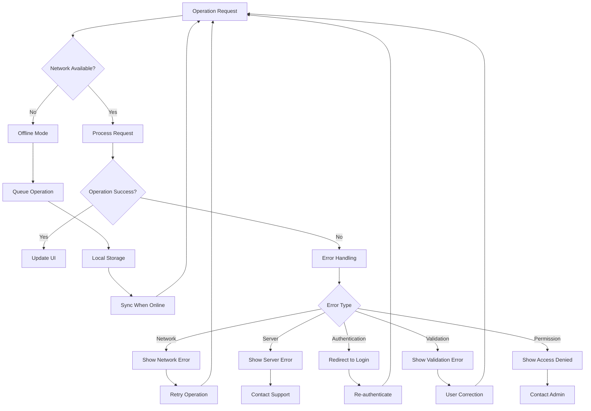

---

## 📊 **Data Migration & Backup Flow**

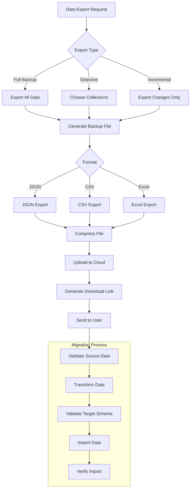

---

## 🔐 **Security Audit Flow**

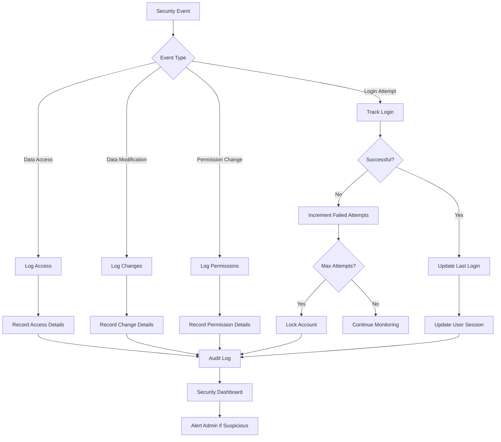

---

This comprehensive flowchart documentation provides a complete understanding of how data flows through the ACCTOO system, how components interact, and how the application handles various scenarios including security, performance, and error recovery.